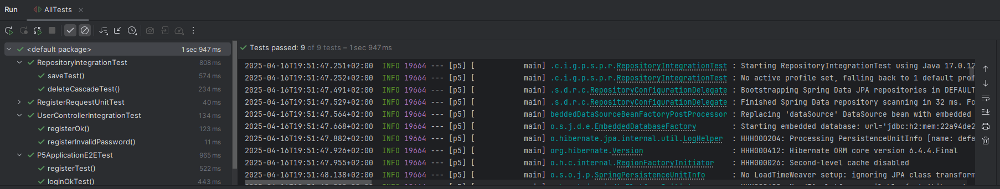

# P5
Aplicación web que usa Spring JPA para persistir los datos de un API REST de gestión de usuarios.
El API permite el registro de nuevos usuarios y su identificación mediante email y password.
Una vez identificados, se emplea una cookie de sesión para autenticar las peticiones que permiten 
a los usuarios leer, modificar y borrar sus datos. También existe un endpoint para cerrar la sesión.  

## Endpoints

// TODO#1: rellena la tabla siguiente analizando el código del proyecto


| Método | Ruta                   | Descripción                                                      | Respuestas                                                   |
|--------|------------------------|------------------------------------------------------------------|--------------------------------------------------------------|
| POST   | `/api/users`           | Registra un nuevo usuario con nombre, email y contraseña        | `201 Created` si tiene éxito, `409 Conflict` si ya existe    |
| POST   | `/api/users/me/session`| Inicia sesión (login) con email y contraseña, devuelve una cookie de sesión | `201 Created` si login correcto, `401 Unauthorized` si falla |
| DELETE | `/api/users/me/session`| Cierra la sesión del usuario autenticado                        | `204 No Content`, elimina la cookie                          |
| GET    | `/api/users/me`        | Devuelve el perfil del usuario autenticado                      | `200 OK` si autenticado, `401 Unauthorized` si no            |
| PUT    | `/api/users/me`        | Actualiza el perfil del usuario autenticado                     | `200 OK` si éxito, `401 Unauthorized` si no autenticado      |
| DELETE | `/api/users/me`        | Elimina la cuenta del usuario autenticado                       | `204 No Content` si éxito, `401 Unauthorized` si no          |


## ✅ Cambios realizados por TODO

### 🟩 TODO#1 – Tabla de endpoints
Se completó la tabla con los endpoints del controlador `UserController`, incluyendo rutas, métodos, descripción y códigos de respuesta (`200`, `201`, `204`, `400`, `401`, `409`).

### 🟩 TODO#2 – Entidad `AppUser`
- Campo `id` autogenerado (`@Id`, `@GeneratedValue`)
- Campo `email` único y con validación `@Email`
- Campos `password`, `name` y `role` como obligatorios (`@Column(nullable = false)`)

### 🟩 TODO#3 – Entidad `Token`
- Relación `@OneToOne` con `AppUser`, configurada con `cascade = REMOVE`

### 🟩 TODO#4 – Repositorio `AppUserRepository`
- Método añadido: `AppUser findByEmail(String email)`

### 🟩 TODO#5 – Repositorio `TokenRepository`
- Método añadido: `Token findByAppUser(AppUser appUser)`

### 🟩 TODO#6 – Implementación de `UserService`
- Métodos del contrato `UserServiceInterface` implementados
- Lógica de login, autenticación, perfil, edición, logout y borrado integrada

### 🟩 TODO#7 – Validaciones con JUnit
- Test de email inválido
- Test de nombre en blanco

### 🟩 TODO#8 – Test de contraseña insegura
- Envío de password no válido (`1234`)
- Comprobación de respuesta HTTP 400

### 🟩 TODO#9 – Test `saveTest()` (repositorios)
- Verificación de guardado y consulta de `AppUser` y `Token`

### 🟩 TODO#10 – Test `deleteCascadeTest()`
- Verificación de borrado en cascada al eliminar un `AppUser`

### 🟩 TODO#11 – Test E2E de login correcto
- Registro seguido de login
- Verificación de código 201 y cabecera `Set-Cookie` con la sesión

### 🟩 TODO#12 – Pruebas REST Client (VSCode)
- Registro, login y acceso a perfil usando cookie de sesión

### 🟩 TODO#13 – Test E2E con Cypress
- Login correcto tras registro
- Verificación de redirección a `app.html` y contenido del perfil

### 🟩 TODO#14 – Cifrado de contraseñas
- Uso de la clase `Hashing` para cifrar contraseñas con PBKDF2
- Comparación segura de contraseñas durante el login
- Adaptación de los tests a este nuevo comportamiento

---

## 🛠️ Bugfixing realizado

- **🧩 Orden incorrecto en `ProfileResponse`** → Se corregió la construcción en `UserService` para que use `name`, `email`, `role`
- **🧩 URL incorrecta en login E2E** → Se cambió `/users/me/session` por `/api/users/me/session`
- **🧩 Código de estado incorrecto en `registerInvalidPassword()`** → Se cambió `409` por `400`, ajustando al comportamiento de Spring
- **🧩 Error de `@Autowired` en tests de repositorio** → Se solucionó asegurando que `Hashing` tenga `@Component` y ajustando el contexto si fuera necesario
- **🧩 JSON esperado vs. real en `registerTest()`** → Se corrigió el orden de campos en `ProfileResponse`

---

## ✅ Resultados de tests

Todos los tests han sido superados satisfactoriamente, como puede verse en la siguiente imagen:




## Comandos 

- Construcción: 
  ```sh
  ./mvnw clean package
  ```

- Ejecución: 
  ```sh
  ./mvnw spring-boot:run
  ```

- Tests:
  ```sh
  ./mvnw test
  ```
